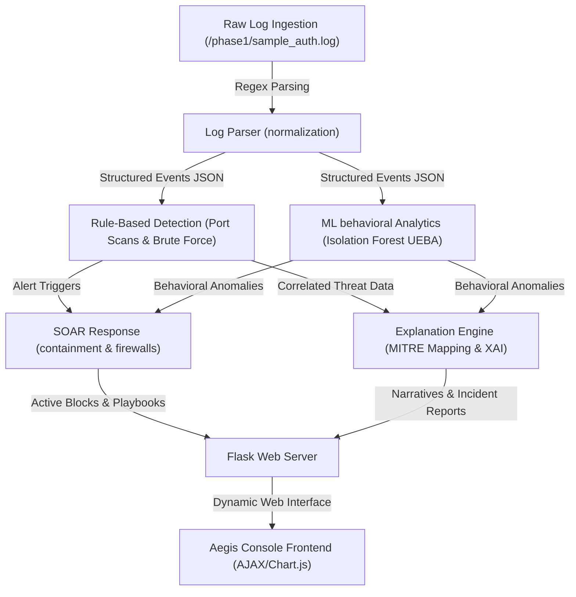

# Aegis SOC — Autonomous Security Operations Platform

Aegis SOC is an autonomous, end-to-end SIEM (Security Information & Event Management) and SOAR (Security Orchestration, Automation, and Response) training and simulation platform. 

It is designed to demonstrate how signature-less Machine Learning behavior analysis (UEBA) and automated playbooks can detect, correlate, and contain active server breaches **in under 3 seconds**—compressing attacker dwell time from weeks to seconds.

---

## 🚀 Key Features

* **Real-time Log Normalization (SIEM)**: Ingests unstructured syslog authentication files and structures them into normalized JSON events using regex matching.
* **Correlated Threat Rules**: Flags port scans and active brute-force attempts. Correlates reconnaissance and exploitation phases to automatically escalate threat levels from HIGH to **CRITICAL**.
* **Behavioral Anomaly Detection (UEBA)**: Integrates an **Isolation Forest** model to detect "Low-and-Slow" brute-force attacks that bypass standard static rule thresholds.
* **Explainable AI (XAI)**: Translates multi-variable model anomalies into plain-English reasoning citing exact statistical Z-score deviations (e.g., *"IP tried 4 unique usernames, deviating 15.2x from baseline"*).
* **MITRE ATT&CK Mapping**: Maps threat vectors directly to tactics and techniques in the MITRE ATT&CK database.
* **SOAR Response Engine**: Executes automated playbooks (incident ticket creation, Slack/Email/SMS/PagerDuty alerts, firewall perimeter IP blocking, and host lockdown checklists).
* **Interactive Dashboard**: A glassmorphic dark-themed web console displaying timeline charts, log streams, firewall blocklists, audit logs, and dynamic investigation reports.

---

## 🛠️ Architecture & Pipeline Flow

Aegis orchestrates a 7-phase security pipeline:



---

## 💻 Tech Stack

* **Core Language**: Python 3
* **Backend Framework**: Flask
* **Machine Learning**: Scikit-Learn (Isolation Forest, StandardScaler)
* **Data Processing**: Pandas, NumPy
* **Frontend**: Vanilla HTML5, CSS3 (Glow & Glassmorphism themes), JavaScript
* **Telemetry Visuals**: Chart.js
* **Automation Webhooks**: PagerDuty, Slack, Email, SMS (simulated)

---

## ⚡ Setup & Quick Start

### 1. Prerequisites
Ensure you have **Python 3.8+** installed.

### 2. Clone and Install Dependencies
```bash
git clone https://github.com/seeratemarryum/aegis-soc.git
cd aegis-soc
pip install -r requirements.txt
```
*(If a `requirements.txt` does not exist, run `pip install Flask scikit-learn pandas numpy`)*

### 3. Generate Simulated Database Logs
Run the pipeline script once to generate initial logs, ML training data, and alerts database:
```bash
python run_all.py
```

### 4. Start the Dashboard Server
Launch the Flask backend and start the real-time simulation engine:
```bash
python phase7/dashboard_server.py
```
Open **[http://localhost:5000](http://localhost:5000)** in your web browser.

---

## 🎮 How the Live Simulation Runs

When you start `dashboard_server.py`, a background thread runs a 30-tick state cycle simulating a live network environment:
1. **Normal Traffic (Ticks 1-10)**: Trusted users connect successfully from local networks.
2. **Reconnaissance (Ticks 11-12)**: An external IP performs rapid connections (Port Scan), triggering a `PORT_SCAN_DETECTED` alert.
3. **Exploitation (Ticks 13-17)**: The attacker IP brute-forces accounts, triggering a `SSH_BRUTE_FORCE` alert.
4. **Breach (Tick 18)**: The attacker logs in successfully, triggering a `BRUTE_FORCE_SUCCESS` alert.
5. **Mitigation (Ticks 19-20)**: The SOAR playbook engine blocks the attacker. Subsequent connections are rejected by the firewall.
6. **Recovery (Ticks 21-30)**: Normal monitoring resumes. The attacker IP resets, and the loop restarts.

---

## 👥 Contributors & Team Roles

This project was built as a collaborative effort by our team of 3 members:

* **Seerat Marryum (Lead Security Engineer & ML)**: Designed the UEBA Isolation Forest machine learning engine, custom feature vector normalizer, and Explainable AI (XAI) mathematical calculations.
* **[Member 2 Name] (SOC Infrastructure Engineer)**: Developed the real-time syslog normalization rules, signature correlation engine, and Flask API integration.
* **[Member 3 Name] (Automation & Interface Designer)**: Constructed the SOAR Playbook Engine, PagerDuty/Slack notification integrations, and developed the glassmorphic dark-themed visual console.
